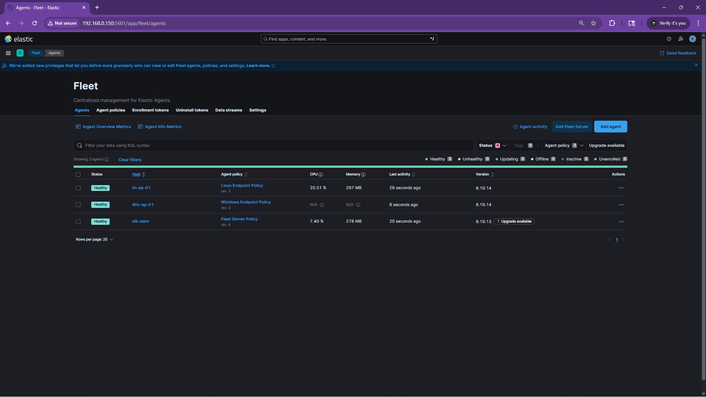

The SIEM was up but it had nothing to look at. I added two endpoints so it actually has something to ingest: a Windows 11 VM and an Ubuntu Server VM, both running in VirtualBox on bridged network.

The Windows side got Sysmon with Olaf Hartong's modular config, PowerShell Script Block Logging turned on, and the Elastic Agent enrolled into Fleet. 
The Linux side got Auditd with Florian Roth's ruleset, which gives a solid baseline of execve, file watch, and network rules out of the box. Then the Elastic Agent on top of that.

Three machines reporting in now: the ELK server, the Windows endpoint, and the Linux endpoint. Next step is building a triage dashboard in Kibana and enabling some detection rules so I can finally start receiving alerts.
