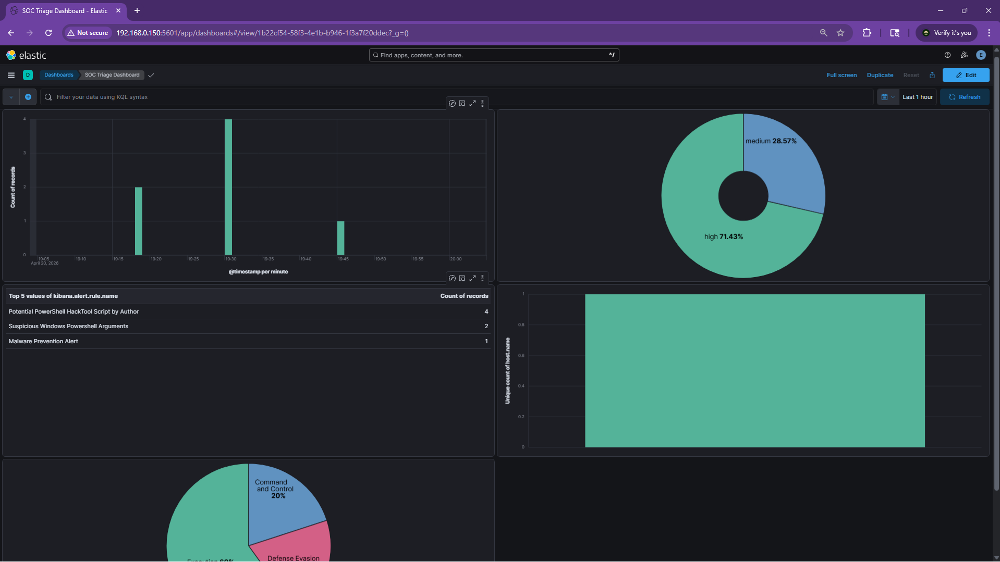
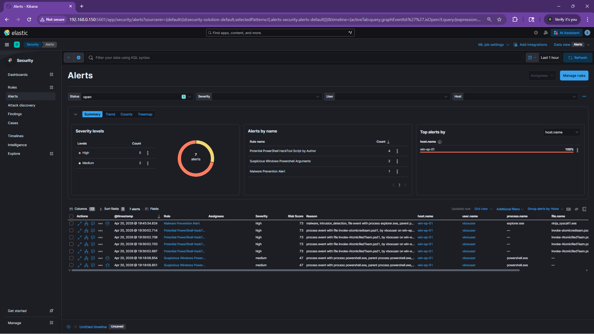
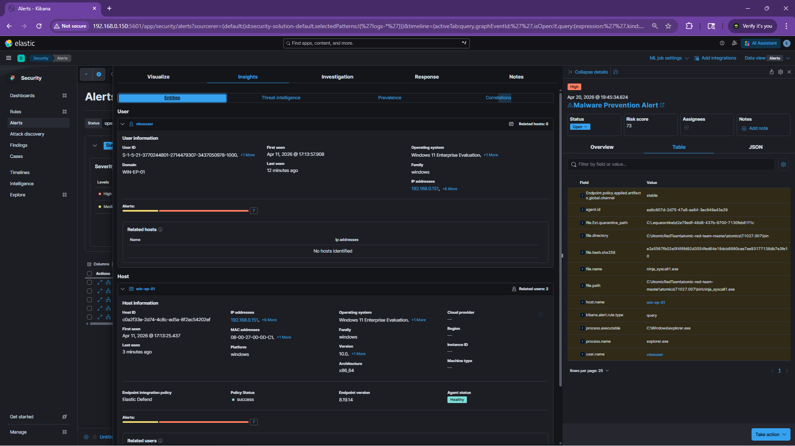
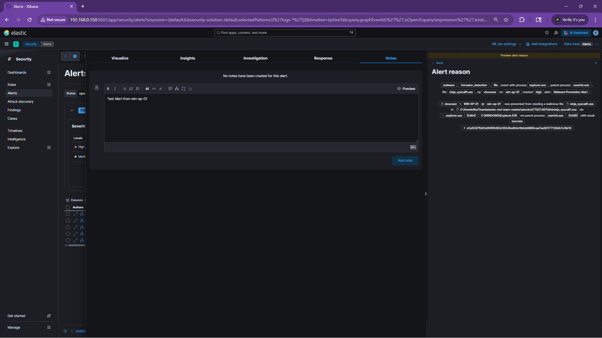

The SIEM was collecting logs but it wasn't doing anything with them. This session I added the detection and alerting layer: Elastic Defend as the EDR on both endpoints, prebuilt detection rules enabled, and a basic custom triage dashboard to monitor everything.

## Elastic Defend

Installed the Elastic Defend integration through Kibana on both Windows and Linux endpoint policies. I set it to Complete EDR for both.

I also had to add the Windows integration separately and enable the Sysmon Operational channel. Without that, most of the Windows detection rules threw warnings about missing indices. The rules expect Sysmon data in `logs-windows.sysmon_operational-*` and that index only exists once the integration is configured to collect from that channel.

## Detection Rules

Elastic have hundreds of prebuilt detection rules. I installed all of them but only enabled the ones relevant to my lab: everything tagged "OS: Windows" and "OS: Linux", plus rules related to PowerShell, LSASS, scheduled tasks, and Elastic Defend. All the cloud and SaaS rules (AWS, Azure, Okta, Google Workspace) stayed disabled since I don't have those data sources for now. I will also integrate some network security policies later.  

Before any of this worked, I had to fix a "Detection engine permissions required" error. Kibana needs encryption keys set in its config before the security features will run. One command to generate the keys, paste them into kibana.yml and restart the service. Small thing but it blocks everything if you miss it.

## The Dashboard

Built a triage dashboard with five panels that give me a quick overview of what's happening across the lab:

- Alert trend over time
- Severity breakdown to prioritize
- Which rules are firing the most
- Which hosts are generating alerts
- Which MITRE ATT&CK tactics are being triggered

All five panels pull from the security alerts index. Right now everything is coming from win-ep-01 since that's where most of the activity is (I did not touch the linux endpoint yet).

## First Alerts

I didn't even need to run attack simulations. Within minutes of enabling everything, alerts started firing from the PowerShell commands I ran while setting things up via the Windows endpoint. The rules caught basic powershell command like "powershell -enc dwBoAG8AYQBtAGkA" a basic whoami command in base64 encode and suspicious PowerShell arguments triggered a medium severity alert. Also Invoke-AtomicRedTeam module files being created on disk triggered a high severity alert and flagged them as potential hack tools. Elastic Defend flagged a malware prevention alert from one of the processes.

Seeing alerts show up in the dashboard I built myself is very satisfying. Here's some further details of one the alert.

## What's Next

The lab is looking good now. SIEM, EDR, endpoints, detection rules, and a dashboard are all working together. Next I will try running a credential dumping simulation and I will be doing a full investigation writeup from alert to conclusion. Let's see how it goes.

