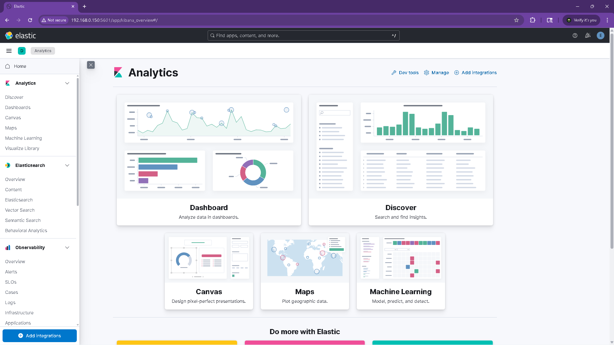
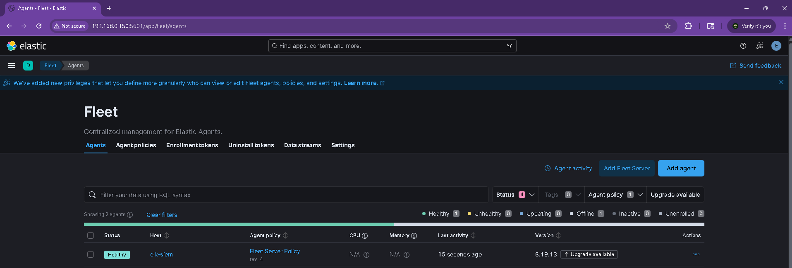

The SIEM is up. Elastic, Kibana, and Fleet Server are running on an Ubuntu 24.04 VM, and Fleet shows the server as Healthy. Next will be the endpoints.

I did the SIEM first so everything else in the lab eventually ships logs into it, so there's no point building endpoints or running attacks until the log destination works.

Also, the VM has 8 GB of RAM, 4 vCPUs, and about 100 GB disk. It's on a bridged adapter so it sits on my home LAN directly, I did set a DHCP reservation on my router as well to make sure it doesn't change ip address. I did forgot on my initial setup, learned that pretty quick. Elasticsearch and Kibana went in from the Elastic 8.19.13 APT packages. The only config changes worth mentioning are binding the services to all interfaces and setting single-node discovery on Elastic. Fleet Server was set up from the Kibana UI once the default Fleet output was pointed at the right address-> 192.168.0.150:8220.

**Kibana Home Page**

**Fleet Server Healthy**

Next, Windows & Linux Endpoints.
